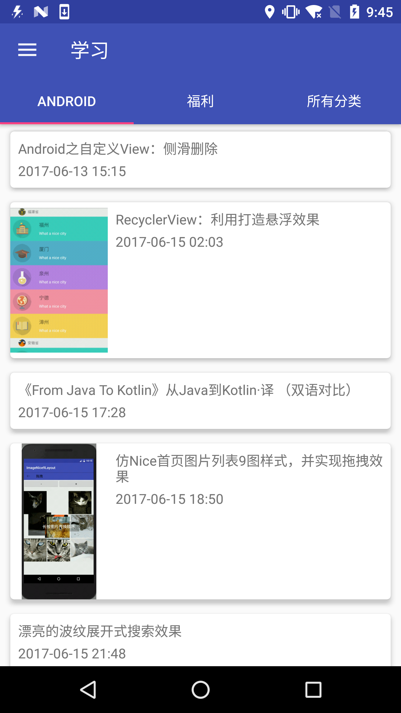

# JokesKotlinmaster
kotlin一个练习项目,上传到github做个备份。其中使用到了干货集中营的api来做测试。感谢！
分三个功能，1、浏览Android技术干货 2、浏览福利,可保存福利到本地 3、可以选择分类来浏览相关技术干货

# 预览

# 感谢
[干货集中营Api](http://gank.io/api)
还有各路github上的大神，有库使用起来真的方便很多
